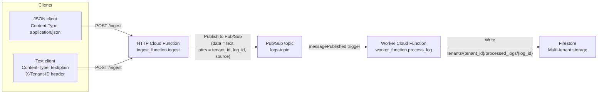

## Robust Multi-Tenant Log Processor (GCP)

This repository contains a **serverless, multi-tenant log ingestion pipeline** implemented on **Google Cloud Platform** for the “Robust Data Processor” backend task.

The system ingests both **JSON** and **raw text** logs via a single `/ingest` endpoint, normalizes them into a unified internal text stream, processes them asynchronously, and stores results in **Firestore** with strict tenant isolation.

---

## Live Endpoint

- **HTTP POST /ingest**  
  **URL**: `https://us-central1-sturdy-block-479917-f6.cloudfunctions.net/ingest`

No authentication is required (intentionally public for evaluation).

---

## Architecture Diagram (JSON + TXT Paths Merge)



**Key idea:** both **JSON** and **TXT** requests are normalized into the **same Pub/Sub message format**:

- **Message data**: flat UTF‑8 text string.
- **Message attributes**: `tenant_id`, `log_id`, `source` (`json_upload` or `text_upload`).

The worker only knows about this unified format; it does not care whether the source was JSON or raw text.

---

## Request Formats (Unified Ingestion Gateway)

### Structured JSON

- **Headers**
  - `Content-Type: application/json`
- **Body**

```json
{
  "tenant_id": "acme",
  "log_id": "123",
  "text": "User 555-0199 accessed the dashboard"
}
```

If `log_id` is omitted, the system generates a UUID. The function validates `tenant_id` and `text` as strings, then publishes the text and attributes to Pub/Sub and returns **202 Accepted**:

```json
{
  "status": "accepted",
  "tenant_id": "acme",
  "log_id": "123"
}
```

### Unstructured Raw Text

- **Headers**
  - `Content-Type: text/plain`
  - `X-Tenant-ID: acme`
- **Body**

```text
User 555-0199 accessed the dashboard via text upload
```

The function reads `tenant_id` from `X-Tenant-ID`, generates a `log_id` (UUID), publishes the text and attributes to the **same Pub/Sub topic** as JSON, and returns **202 Accepted** with the generated `log_id`.

---

## Multi-Tenant Storage Layout (Firestore)

Processed logs are written to Firestore using a **tenant-isolated hierarchy**:

```text
tenants/{tenant_id}/processed_logs/{log_id}
```

Example documents created by the system:

```text
tenants/acme/processed_logs/123
  source: "json_upload"
  original_text: "User 555-0199 accessed the dashboard"
  modified_data: "User [REDACTED] accessed the dashboard"
  processed_at: "<UTC timestamp>"

tenants/beta_inc/processed_logs/<uuid>
  source: "text_upload"
  original_text: "User 555-0199 accessed the dashboard via text upload"
  modified_data: "User [REDACTED] accessed the dashboard via text upload"
  processed_at: "<UTC timestamp>"
```

This layout ensures:

- **Strict tenant separation** (no flat `all_logs` collection).
- A clear path for the rubric’s **Isolation Check** (`acme` vs `beta_inc`).

---

## Crash Simulation & Resilience (Short Explanation)

The system is designed so that **API calls remain fast and reliable**, even if the worker crashes or is slow.

- **Non-blocking ingest path**
  - `/ingest` only:
    - Validates the request.
    - Normalizes it into text + attributes.
    - Publishes to Pub/Sub.
  - It **does not** touch Firestore or run heavy work, so it can handle high RPM and always return **202 Accepted** quickly.

- **Simulated heavy processing**
  - The worker Cloud Function sleeps for **0.05 seconds per character of text**, capped by `MAX_TOTAL_SLEEP` (e.g. 55 seconds) to avoid hitting the function timeout.
  - This models CPU-bound work that scales with payload size.

- **Crash handling**
  - If the worker fails (throws an exception or times out), **Pub/Sub automatically retries delivery** according to its retry policy.
  - Writes to Firestore are **idempotent**:
    - Each message includes `tenant_id` and `log_id`.
    - The document key is exactly `tenants/{tenant_id}/processed_logs/{log_id}`.
    - If the same message is processed multiple times, it simply overwrites the same document, so retries do **not** create duplicates.

Together, this architecture:

- Keeps the `/ingest` API responsive under a **1,000 RPM chaos test**.
- Ensures work is retried safely if the worker crashes mid-process.
- Preserves strict tenant separation at the storage layer.


